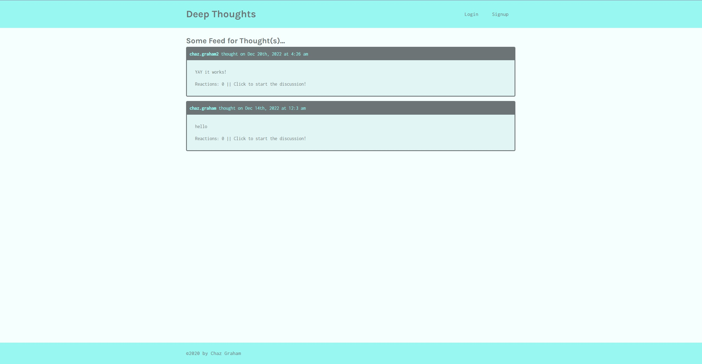

# Deep Thoughts

## Descripton
This application uses mongoBD for back-end and react for the front-end, Using  graph QL mutations and queries to communicate between the two. The user can post, delete thoughts as well as add friends. 
https://chaz-deep-thoughts.herokuapp.com/

## Table of Contents
  * [Installation Instructions](#installation-instructions)
  * [Application Usage](#application-usage)
  * [Contributors](#contributors)
  * [Licenses](#licenses)
  * [Tests](#tests)
  * [Contact Me](#contact-me)

## Installation Instructions
Before running this application you must install -please npm install/npm install express/npm i mongoose

## Application Usage
-A social apllication that allows users to add friends post their thoughts and comment on other peoples posts.

## Contributors
By Chaz Graham

## Licenses
This application is licensed under: None

## Tests
To test application open the console and run the following comand: none

## Contact Me
If you have additional questions you can contact me at https://github.com/chazgraham